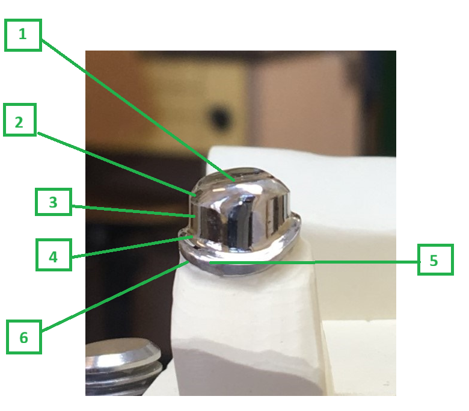

<!--
author:    Hilke Domsch; Alexander Meiwald
email:     hilke.domsch@gkz-ev.de
date:      2025-11-12
version:   0.0.7

narrator:  Deutsch Male
language:  de

edit:      https://liascript.github.io/LiveEditor/?/github/Ifi-DiAgnostiK-Project/zahntechnik-zahn-5-23-aesthetischer-zahnersatz

icon:      https://ifi-diagnostik-project.github.io/assets/img/Logo_234px.png
logo:      assets/images/zahntechniker_et_work.jpg

title:     ZAHN 5-23 Herstellen eines funktionellen ästhetischen Zahnersatzes
comment:   ZAHN 5-23 Funktionellen ästhetischen Zahnersatz herstellen
attribute: https://pixabay.com/de/photos/zahnarzt-gebiss-klinik-zahnklinik-6225092/
tags:      Zahntechniker,
           Zahnersatz,
           Primärteleskop,
           Fräsen,
           Fräs- und Verblendtechniken,
           Prothetik,
           Krone,
           Doppelkrone,
           Verblendung

link:      style.css
import:    https://raw.githubusercontent.com/Ifi-DiAgnostiK-Project/LiaScript_DragAndDrop_Template/refs/heads/main/README.md
           https://raw.githubusercontent.com/Ifi-DiAgnostiK-Project/Piktogramme/refs/heads/main/makros.md
           https://raw.githubusercontent.com/Ifi-DiAgnostiK-Project/Textilpflegesymbole/refs/heads/main/makros.md
           https://raw.githubusercontent.com/Ifi-DiAgnostiK-Project/LiaScript_ImageQuiz/refs/heads/main/README.md
           https://raw.githubusercontent.com/Ifi-DiAgnostiK-Project/Bildersammlung/refs/heads/main/makros.md
-->

# ZAHN 5-23: Herstellen eines funktionellen ästhetischen Zahnersatzes

Sie haben in den letzten Tagen verschiedene fachpraktische Tätigkeiten zum Herstellen eines funktionellen ästhetischen Zahnersatzes durchgeführt.      __Überprüfen Sie Ihr Wissen.__

<!-- class="highlight" -->
Wir wünschen Ihnen viel Erfolg beim Beantworten der Fragen!

   

")<!-- style="width: 500px" -->

## 1. Das Primärteleskop

<section class="flex-container border">

<!-- class="highlight"-->
Ordnen Sie den Zahlen 1 - 6 im Bild den jeweils richtigen Fachbegriff zu.

 

<!-- data-randomize data-show-partial-solution -->
1<!--style="color: green; font-weight: bolder"-->  =  [[ Teleskoprand | (Okklusalfläche)   | Okklusale Phase  |   Zervikaler Rand |  Zervikale Stufe |  Gefräßte Fläche]]

 

<!-- data-randomize data-show-partial-solution -->
2<!--style="color: green; font-weight: bolder"-->  =  [[ Teleskoprand | Okklusalfläche   | (Okklusale Phase)  |   Zervikaler Rand |  Zervikale Stufe |  Gefräßte Fläche]]

 

<!-- data-randomize data-show-partial-solution -->
3<!--style="color: green; font-weight: bolder"-->  =  [[ Teleskoprand | Okklusalfläche   | Okklusale Phase  |   Zervikaler Rand |  Zervikale Stufe |  (Gefräßte Fläche) ]]
 

<!-- data-randomize data-show-partial-solution -->
4<!--style="color: green; font-weight: bolder"-->  =  [[ Teleskoprand | Okklusalfläche   | Okklusale Phase  |   Zervikaler Rand |  (Zervikale Stufe) |  Gefräßte Fläche]]

<!-- data-randomize data-show-partial-solution -->
5<!--style="color: green; font-weight: bolder"-->  =  [[ Teleskoprand | Okklusalfläche   | Okklusale Phase  |   (Zervikaler Rand) |  Zervikale Stufe |  Gefräßte Fläche]]

<!-- data-randomize data-show-partial-solution -->
6<!--style="color: green; font-weight: bolder"-->  =  [[ (Teleskoprand) | Okklusalfläche   | Okklusale Phase  |   Zervikaler Rand |  Zervikale Stufe |  Gefräßte Fläche]]

<!-- style="max-width: 550px; width: 100%" -->

</section>

## 2. Fügetechniken in der Zahntechnik (allgemein)

<section class="flex-container border">

<!-- class="highlight"-->
Welche Fügetechnik gibt es in der Zahntechnik NICHT?

<!--style="color: red"-->Es sind mehrere Antworten richtig.

<!-- data-randomize -->
- [[X]] Nieten
- [[X]] Punktschweißen
- [[ ]] Kleben
- [[ ]] Löten
- [[ ]] Lasern

</section>

")<!-- style="width: 500px" -->

## 3. Die Klebeverbindung in der Zahntechnik

<section class="flex-container border">

<!-- class="highlight"-->
Welcher Fachbegriff bezeichnet eine zahntechnische Klebeverbindung?

<!-- data-randomize -->
- [( )] additives Fügen
- [(X)] adhäsives Verbinden
- [( )] adhärente Fusion
- [( )] Koagulationsbindung

<!-- style="max-width: 250px; width: 100%" -->

</section>

<section class="flex-container border">

<!-- class="highlight"-->
Welche Aussage zum Kleben in der Zahntechnik ist korrekt?

<!-- data-randomize -->
- [( )] Kleben ist ein lösbares Fügeverfahren, da die beiden zu verklebenden Teile zusätzlich durch mechanisches Verhaken miteinander verbunden werden.
- [(X)] Kleben ist ein stoffschlüssiges Fügen zweier fester Teile, welche aus gleichen oder unterschiedlichen Materialien bestehen können.
- [( )] Beim Kleben werden die Oberflächen der zwei Teile durch Hitze aufgeschmolzen und anschließend miteinander verschmolzen.
- [( )] Kleben bezeichnet ein Verfahren, bei dem ein dünner Metallfilm zwischen zwei Teile eingebracht wird, um diese anschließend durch Druck dauerhaft miteinander zu verbinden.

</section>

## 4. Berechnung des Metallgewichts

<!--style="font-size: large;font-weight: bolder"-->Folgende Daten sind gegeben:

<!--style="font-size: large;"-->Wachgewicht: 1,2 g
 
Dichte Metall: 8,2 g/cm³
 
Dichte Wachs: 0,98 g/cm³

<!--style="font-size: large;font-weight: bolder"-->gesucht: Metallgewicht $W_{M}$

<!--style="font-size: large;font-weight: bolder; color: green"-->
Für die Berechnung des Metallgewichts wird der klassische Dreisatz angewendet.

<section class="flex-container border">

<!-- class="highlight"-->
Wählen Sie die richtige Formel zum Berechnen von $W_{M}$ aus.

<!-- data-randomize -->
- [( )] $W_{M}$<!-- style="color: blue" --> $\text{=}$ $\frac{{0,98 g/cm³}  {\cdot}   {8,2g/cm³}}{1,2g}$<!--style="font-size: large;font-weight: bold"-->
- [( )] $W_{M}$<!-- style="color: blue" --> $\text{=}$ $\frac{\pi   {\cdot}   {1,2g}   {\cdot}   {8,2g/cm³}}{0,98 g/cm³}$<!--style="font-size: large;font-weight: bold"-->
- [(X)] $W_{M}$<!-- style="color: blue" --> $\text{=}$ $\frac{{1,2g}   {\cdot}   {8,2g/cm³}}{0,98 g/cm³}$<!--style="font-size: large;font-weight: bold"-->

</section>

<section class="flex-container border">

<!-- class="highlight"-->
Wie hoch ist das Metallgewicht?\
Wählen Sie das richtige Ergebnis.

<!-- data-randomize -->
- [( )] 4,10 g
- [(X)] 10,04 g
- [( )] 10,75 g
- [( )] 4,50 g
****************************************
**Lösung**
======

Da das Volumen beim Gussprozess gleich bleibt (Wachsmodell → Metallgussstück), gilt:

$V = \frac{W_W}{\rho_W} = \frac{W_M}{\rho_M}$

Damit:

$W_M = W_W \cdot \frac{\rho_M}{\rho_W}$

Einsetzen der Werte:

$W_M = 1{,}2\,\text{g} \cdot \frac{8{,}2\,\text{g/cm}^3}{0{,}98\,\text{g/cm}^3}$

$W_M = 1{,}2 \cdot \frac{8{,}2}{0,98}$

$W_M \approx 10{,}04\,\text{g}$

---

**Ergebnis**
========

$\boxed{W_M \approx 10{,}04\,\text{g}}$

****************************************

<!-- style="max-width: 200px; width: 100%" -->

</section>

## 5. Werkstoffe in der Teleskoptechnik

<section class="flex-container border">

<!-- class="highlight"-->
Welche Werkstoffe werden üblicherweise in der Zahntechnik für die Teleskoptechnik eingesetzt?

<!--style="color: red"-->Es sind mehrere Antworten richtig.

- [[ ]] Zirkonoxid (nur sekundär)
- [[ ]] PMMA (nur primär)
- [[X]] CoCr
- [[X]] hochgoldhaltige Legierungen
- [[X]] goldreduzierte Legierungen

")<!-- style="max-width: 200px; width: 100%" -->

</section>

## Super gemacht! 🙌

